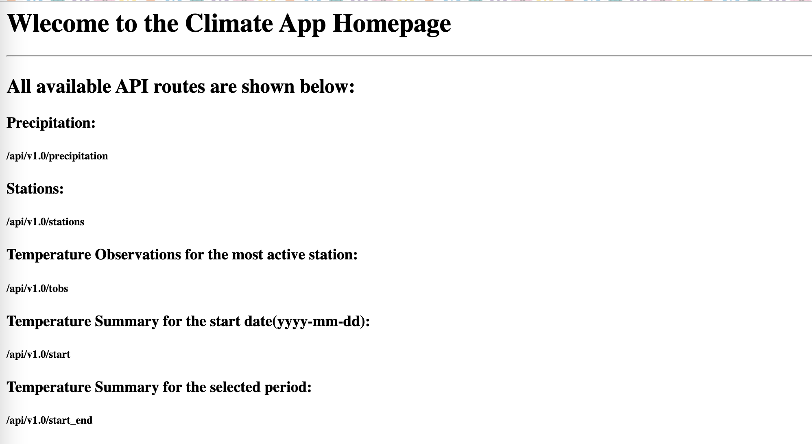
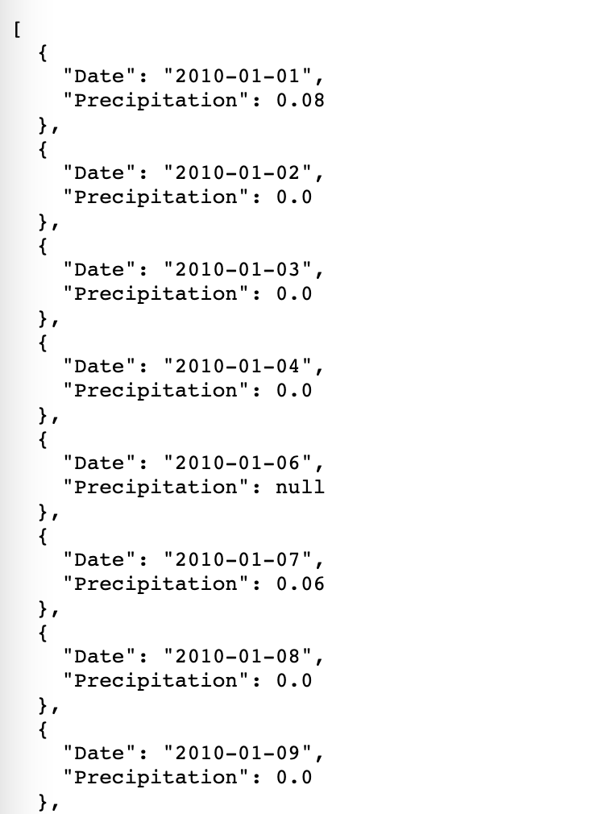
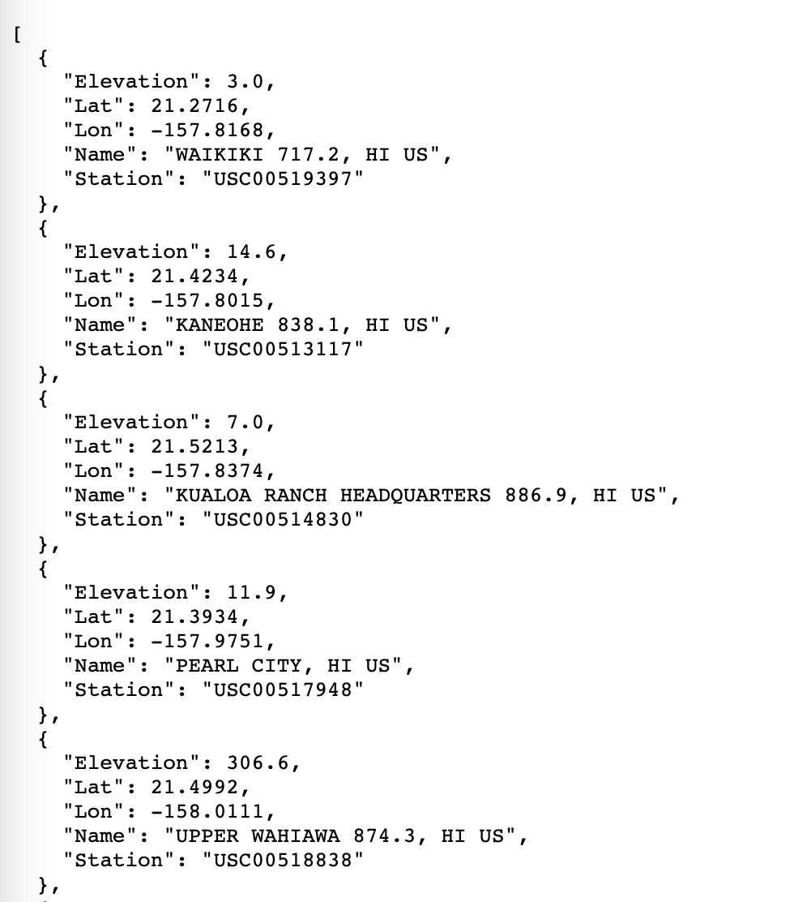
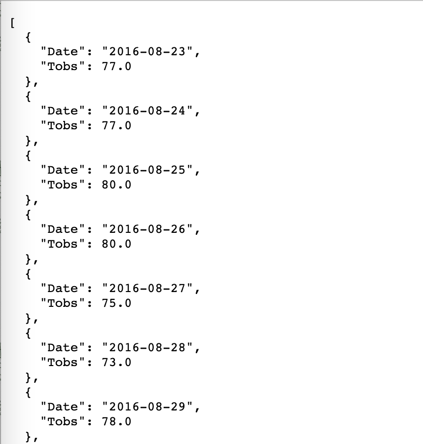
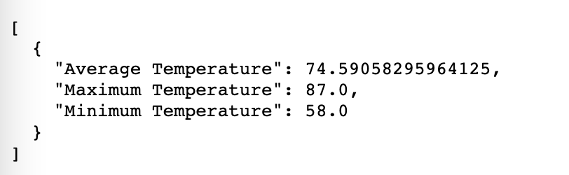

# **Sqlalchemy Challenge: Surfs Up!** 

<h2><b>Step 1 - Climate Analysis and Exploration</b></h2>

The climate analysis and data exploration involved using Python, SQLAlchemy, ORM queries, Pandas and Matplotlib. 

* SQLAlchemy <mark style="background-color: grey">create_engine</mark> is used to connect to the provided sqlite data base called <a href="Resources/hawaii.sqlite">hawaii.sqlite</a>

* SQLAlchemy <mark style="background-color: grey">automap_base()</mark> is used to reflect the tables into classes and save a reference to those classes called <mark style="background-color: lightblue">Station</mark> and <mark style="background-color: lightblue">Measurement.</mark>

<h3><b>Precipitation Analysis</b></h3>

The query is to retrieve the last 12 months of precipitation data. The results were loaded into a Pandas DataFrame and visualised using the plot method.

<h3><b>Station Analysis</b></h3>

Several queries were designed to:

1. Calculate the number of total stations

2. Find the most active stations
- The stations are listed in decsending order
- The station with the highest number of observations is found
- Functions such as <mark style="background-color: grey">func.min</mark>, <mark style="background-color: grey">func.max</mark>, <mark style="background-color: grey">func.avg</mark> and <mark style="background-color: grey">func.count</mark> are used in the queries
3. To retrive the last 12 months of temperature observation data (TOBS)
- The query is filtered by the station with the highest number of observations
- The results are plotted as a histogram.

<h2><b>Step 2 - Climate App using Flask</b></h2>

This task is to design a Flask application and create routes based on the queries from task 1.

The queries will return in JSON format.

<h3><b>API Routes</b></h3>

<h4><b>1. Homepage</b></h4>

<h4><b>2. Precipitation</b></h4>

<h4><b>3. Stations</b></h4>

<h4><b>4. Temperature Observation Data of the most active Station</b></h4>

<h4><b>4. Temperature summary for a given start date</b></h4>

